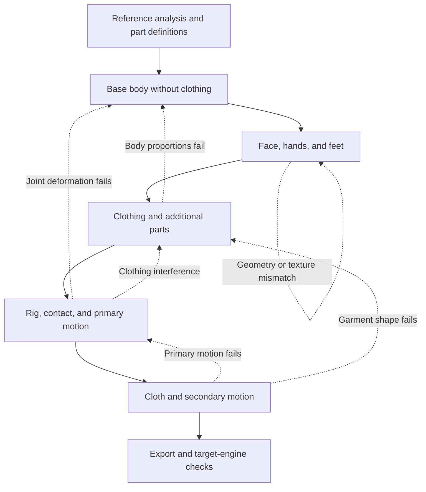

# Character production workflow

Move from reference images to generated parts, assembly, and animation in stages. Assess operation completion, reference fidelity, and natural-looking movement separately. The checks below reflect observations from specific experiments, not a performance benchmark for every 3D generation model.

## 1. Analyze references and define parts

Use [character-reference-analysis](../skills/character-reference-analysis/SKILL.md).

Confirm front, side, and back correspondence. Separate shared anatomy, clothing, and character-specific parts. Use SAM-family tools for image regions and OpenPose or similar tools for candidate joints. Overlay results on source images to check misdetections and left/right labels.

Record dimensions, orientation, symmetry, attachment points, and candidate bone connections for each generation unit. Distinguish observed, estimated, and unknown information. Hidden body thickness, joint axes, and weights need separate 3D checks; segmentation and pose landmarks do not determine them.

**Proceed when:** every generation target has a reference, an orientation, and visible uncertainty. Resolve contradictory views or limit the prototype scope before generating parts.

## 2. Validate the unclothed base body

Use [character-base-body](../skills/character-base-body/SKILL.md).

Check proportions, arm and leg thickness, T-pose, and joint placement without clothing. Preserve the body baseline rather than making anatomy excessively thin to fit an outfit. Inspect front, side, and oblique views, then try small joint bends.

**Proceed when:** the body matches the intended proportions and the tested bends do not produce major collapse. If anatomy or deformation fails, revisit body shape, pose alignment, or weights before fitting clothing.

## 3. Refine the face, hands, and feet

Use [character-face-hands](../skills/character-face-hands/SKILL.md).

Check eyes, eyelids, nose, lips, mouth interior, fingers, and ankle connections within the requested scope. Fine facial and extremity geometry showed more visible failures in the experiments than simple bodies, shoes, or clothing in static views. Select local modeling, retopology, separate generation, or approved existing parts according to the defect; splitting generation does not guarantee improvement.

Compare static shape, blinking, mouth opening, and requested bends with textures visible. Moving a painted eye or mouth without matching geometry can remain unnatural. Label geometry-only inspection explicitly.

**Proceed when:** geometry, UVs, textures, and the tested movements agree. Return surface misalignment or unnatural closure to detail refinement before adding more expressions.

## 4. Fit clothing and additional parts

Use [character-clothing-fit](../skills/character-clothing-fit/SKILL.md).

Fit clothing, shoes, hair, and any character-specific ears or tail around the body baseline. Keep parts separately editable. Record attachments, parenting, follow targets, and clearance.

Inspect static silhouettes and small movements separately. Clothing that looks clean at rest can still fold or penetrate during motion. Compare clothing-on/off views in fixed poses. Reducing penetration through a large hem bulge can worsen the silhouette.

**Proceed when:** attachments, clearance, and silhouette are acceptable in the tested poses. Revisit garment shape, topology, or weights if correction requires large bulges; revisit the body if proportions have been compromised.

## 5. Validate the rig and primary motion

Use [character-rig-motion](../skills/character-rig-motion/SKILL.md).

Fit bones to the actual body and rest pose. Progress from local joint bends to pelvis lowering, alternating foot lifts, and walking as requested. Distinguish stance and swing feet; measure sole height, foot sliding, and IK error alongside front/side visual checks.

Natural-looking walking requires more than periodic foot motion. Review weight transfer, pelvis movement, arm swing, and heel/toe roll. A functioning rig or IK system does not by itself establish natural motion.

**Proceed when:** the tested primary motion maintains acceptable body deformation and contact. Return joint failures to body/weight correction and clothing failures to fitting.

## 6. Trial cloth and secondary motion

Use [character-cloth-secondary-motion](../skills/character-cloth-secondary-motion/SKILL.md).

After validating primary motion, trial sway for clothing, hair, ears, and tails. Choose helper bones, corrective shapes, or physics for the intended use. For cloth simulation, inspect proxy geometry, pins, collisions, modifier order, and successful motion-transfer binding.

Preserve raw results separately from adopted corrections. In the experiments, a cloth proxy rolled up at the hem and the intended transfer setup failed. Attenuation and amplitude limits produced a playback prototype; they did not establish successful natural cloth physics. Do not reuse trial parameters as universal settings.

**Proceed when:** the adopted result is stable within the tested scope, preserves the silhouette, and reproduces after reopening. State whether it is authored motion, live physics, or corrected baked playback. Revisit garment fitting or primary motion when their failures are driving secondary-motion problems.

## 7. Record and hand off

At each stage, save inputs, edits, comparison images, inspection results, and unresolved issues. State tested poses, frame ranges, and inspection directions. A single-direction coverage check does not establish collision behavior in all directions.

Keep editable controls separate from baked playback data. After GLB or FBX export, reimport and check the required movements. Record file size, memory, and reuse limits when baking dense per-frame morphs.

For Unity delivery, verify avatar setup, bone mapping, rest pose, and motion separately from Blender playback. Generic/Humanoid compatibility remains unverified until tested in the target engine. Mark unperformed checks as untested.
